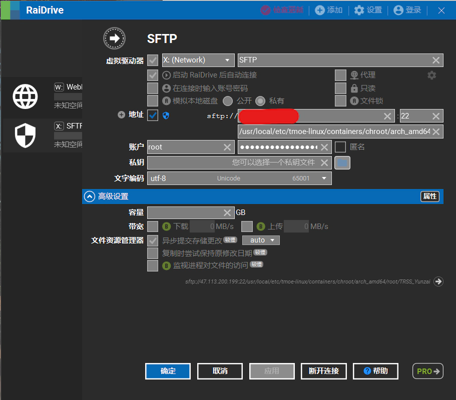
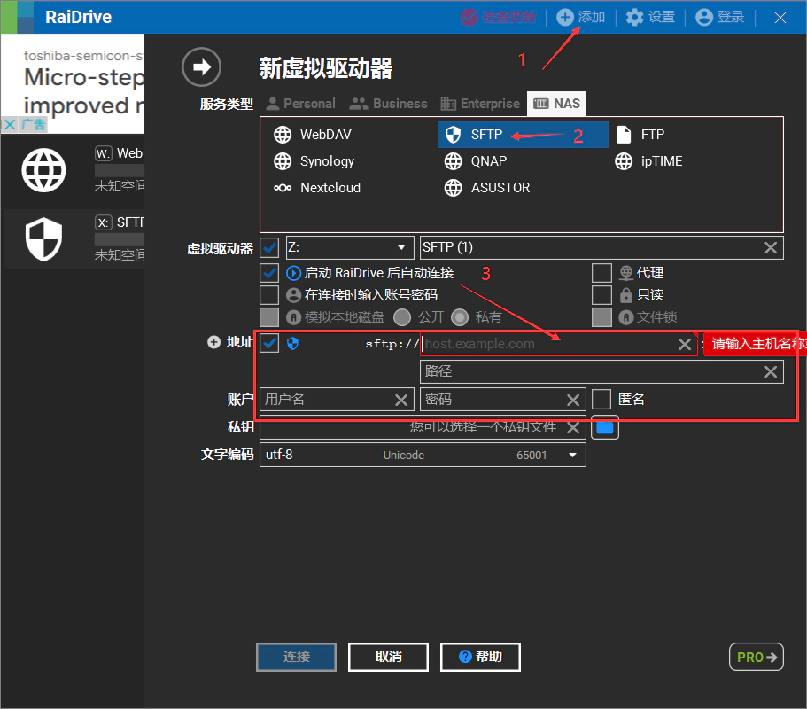
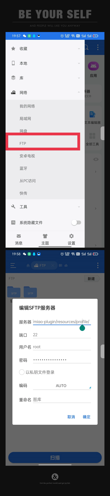

<p align="center">
  <a href="https://github.com/lc-hongdou/gallery" target="_blank"></a>

  # 喵喵插件（miao-plugin）角色面板图库
  [](https://github.com/lc-hongdou/gallery)

</p>


## 介绍❤❤❤❤❤
- 用于`Yunzai-Bot`V3_`喵喵插件`（miao-plugin）的角色面板`webp格式`的图库<br>
由于占用的原因，本仓库只包含`旅行者`的面板图
> 其他角色的请移步我的其他仓库<br>
💧[`水元素`](https://github.com/lc-hongdou/shui)
🔥[`火元素`](https://github.com/lc-hongdou/huo)
🧊[`冰元素`](https://github.com/lc-hongdou/bing)
⚡[`雷元素`](https://github.com/lc-hongdou/lei)
🌎[`岩元素`](https://github.com/lc-hongdou/yan)
🍀[`草元素`](https://github.com/lc-hongdou/cao)
🌀[`风元素`](https://github.com/lc-hongdou/feng)

> 单角色可看右侧[`Release`](https://github.com/lc-hongdou/gallery/releases)<br>
单独下载*.zip文件解压，Linux系统unzip *.zip解压
下载慢的话可以复制链接去☞[`加速下载`](https://doget.nocsdn.com)

 图库说明

<details><summary>展开</summary>

> 此库提供由我与他人（主要为`椰奶群`抠图大佬）扣制的自主整理群文件上传的角色面板图<br>
整理了很久把格式换成webp，主要是想回馈群友，服务器图片一张张放上去太难了<br>
一张张核对基本没有重复的（肝开始疼了），并且进行了[‘文件夹+序号’的重命名](./rename.bat)排序<br>
如果您想为此仓库贡献<br>
请见☞[`贡献指南`](./resources/CONTRIBUTING.md)向此仓库发起 pull request

</details>

 食用方法🔥🔥🔥🔥

<details><summary>拉取链接(选其中一个即可)</summary>

```
git clone https://gitclone.com/github.com/lc-hongdou/gallery.git
```
```
git clone https://ghproxy.com/https://github.com/lc-hongdou/gallery.git
```
```
git clone https://hub.njuu.cf/lc-hongdou/gallery.git
```
```
git clone https://kgithub.com/lc-hongdou/gallery.git
```

放在<br>
```
Yunzai-bot/plugins/miao-plugin/resources/profile/normal-character
```

等待完成就行了，失败大概是网络问问题<br>
自行决定图库用于什么面板<br>
普通面板(图鉴/非彩蛋面板等)存放位置<br>
```
Yunzai-bot/plugins/miao-plugin/resources/profile/normal-character
```
或者 彩蛋(三皇冠/ACE/满命)存放位置<br>
```
Yunzai-bot/plugins/miao-plugin/resources/profile/super-character
```

</details>

 更新仓库图片

<details><summary>展开</summary>

- 在上面位置输入下面指令更新图片，先clone再更新<br>

```
git pull
```
另外更新图片频率取决于作者忙不忙，有需要可以进群求帮助<br>

</details>

 不更新某些角色图片

<details><summary>展开</summary>

在.gitgnore文件填写图库路径，如：
```
/罗莎莉亚
/优菈
```

</details>

 本地管理远程服务器图片

<details><summary>展开</summary>

用FTP软件管理远程图片的时候很麻烦<br>
（因为大部分FTP软件不能显示图片，反正我没用过能显示图片的）<br>
 - Windows推荐用[`Raidrive`](https://www.raidrive.com/)来管理远程图片<br>
  
  
 - Android推荐用[`ES文件浏览器`](http://www.estrongs.com/)来管理远程图片<br>
  
  
🔗🔗 链接🔗🔗
[](https://www.raidrive.com/)
[](http://www.estrongs.com/)

</details>

 版权免责声明👀👀

<details><summary>展开</summary>

图片为椰奶群的大佬扣的，本人不负责任何版权问题<br>
部分图片容易封号，账号出问题概不负责<br>
对于获取原图易造成的问题可以复制[`这个插件`](./resources/屏蔽喵喵面板原图.js)至<br>
```
/plugins/example
```
只有主人能发送获取原图的指令，自己看着决定吧<br>
仅限内部小范围使用，请勿用此图库用于盈利

</details>

 了解更多

<details><summary>展开</summary>

| 群号 | 254974507 | 椰奶杂货铺 |
| --- | --- | --- |

（在里面划水bushi）

</details>

## 🔗🔗项目地址🔗🔗

[](https://www.raidrive.com/)
[](http://www.estrongs.com/) [](https://gitee.com/Le-niao/Yunzai-Bot) [](https://gitee.com/yoimiya-kokomi/miao-plugin) 
[](https://gitee.com/Hikari666/Yunzai-Bot-plugins-index) 
* Yunzai-Bot：[Gitee](https://gitee.com/Le-niao/Yunzai-Bot) & [Github](https://github.com/Le-niao/Yunzai-Bot)
* Miao-plugin：[Gitee](https://gitee.com/yoimiya-kokomi/miao-plugin) & [Github](https://github.com/yoimiya-kokomi/miao-plugin)
* Yunzai-Bot插件库：[Gitee](https://gitee.com/Hikari666/Yunzai-Bot-plugins-index) & [GitHub](https://github.com/HiArcadia/Yunzai-Bot-plugins-index)
* 最后再求个star，你的支持是维护本项目的动力~~
* 严禁用于任何商业用途和非法行为


## 🔗🔗其他图库地址🔗🔗

[](../../../shui)
[](../../../huo)
[](../../../bing)
[](../../../lei)
[](../../../yan)
[](../../../cao)
[](../../../feng)


</details>
